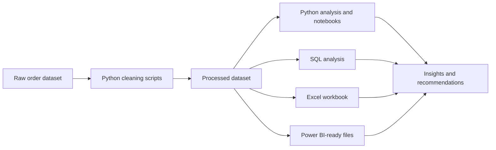

# Food Delivery Profitability Analysis

## Project Overview

This repository contains an end-to-end analytics project for a food delivery platform operating across major Indian cities. It analyzes order profitability, discount efficiency, customer retention, delivery delays, ratings, restaurant-zone performance, and repeat-order behavior using Python, SQL, Excel, and Power BI-ready outputs.

Key capabilities:

- Clean raw food delivery order data into an analysis-ready dataset.
- Generate profitability, discount, city, zone, customer, and retention summaries.
- Run SQL queries for repeatable business analysis.
- Produce Excel workbook outputs for KPI review.
- Export Power BI-ready CSV files.
- Create Python analysis artifacts and summary reports.
- Document business insights and recommended operational actions.

## Architecture



End-to-end pipeline:

1. Raw synthetic food delivery orders are stored under `data/raw`.
2. Python scripts clean duplicate rows, inconsistent categories, missing values, timestamps, and outliers.
3. The cleaned dataset is written to `data/processed`.
4. Analysis scripts and notebooks calculate KPIs, profitability views, delay patterns, discount behavior, customer segments, and repeat-order signals.
5. Outputs are exported to `artifacts`, `excel`, and `powerbi`.
6. Findings are summarized in `insights` for future analysis and decision reuse.

## Tech Stack

| Layer | Technology | Purpose |
|---|---|---|
| Data cleaning | Python, pandas, NumPy | Data wrangling and feature engineering |
| Analysis | pandas, SciPy, scikit-learn | KPI analysis, statistics, segmentation, repeat-order scoring |
| Visualization | matplotlib, seaborn | Optional chart generation |
| SQL | Standard SQL scripts | Repeatable business queries and schema definition |
| Reporting | Excel workbook | KPI review, pivots, validation, workbook analysis |
| BI serving | Power BI-ready CSV | Dataset prepared for dashboard import |
| Documentation | Markdown | Data dictionary, insights, recommendations, chart plan |

## Data Flow

1. Ingestion: raw food delivery records are read from `data/raw/food_delivery_raw.csv`.
2. Processing: scripts clean data, standardize fields, handle quality issues, and engineer profit, delay, discount, and retention features.
3. Storage: cleaned data is stored in `data/processed/food_delivery_cleaned.csv` and Power BI-ready data is stored in `powerbi/powerbi_ready_files`.
4. Transformation: Python, SQL, and Excel produce aggregated views by city, zone, discount band, customer segment, restaurant, and retention behavior.
5. Serving: artifacts, workbook outputs, Power BI-ready files, and insight documents provide reusable analysis outputs.

## Setup Instructions

### Prerequisites

- Python 3.11 or later
- pip
- Optional: Jupyter, Excel, and Power BI Desktop

### Environment Variables

No environment variables are required. `.env` is ignored for local experimentation.

### Docker Setup

Docker is not required. The project runs with local Python tooling.

### Local Run Steps

Create and activate a virtual environment:

```bash
python -m venv .venv
.venv\Scripts\activate
```

Install dependencies:

```bash
pip install -r requirements.txt
```

Run the full Python analysis:

```bash
python scripts/05_full_python_analysis.py
```

Optional workbook generation:

```bash
python scripts/build_excel_workbook.py
```

## Project Structure

```text
.
|-- data/
|   |-- raw/                         # Source order dataset
|   |-- processed/                   # Cleaned analysis dataset
|   |-- reference/                   # Data dictionary
|-- scripts/                         # Cleaning, analysis, statistics, ML, workbook scripts
|-- notebooks/                       # Exploratory notebooks by analysis stage
|-- sql/                             # Schema and business analysis queries
|-- excel/                           # Workbook plan and generated workbook
|-- powerbi/                         # Power BI-ready CSV outputs
|-- insights/                        # Executive summary, business insights, recommendations
|-- artifacts/
|   |-- analysis_outputs/            # Aggregated summary CSVs
|   |-- python_analysis/             # Python-generated outputs and summary report
|   |-- dashboard-chart-plan.md      # Dashboard chart planning notes
|   |-- sample-kpi-snapshot.md       # KPI snapshot artifact
```

## Key Components

### ETL Pipeline

The ETL pipeline is file-based:

- Extract: read raw CSV files from `data/raw`.
- Transform: clean, standardize, and engineer analytical fields through Python scripts.
- Load: write processed CSVs and analysis outputs to `data/processed`, `artifacts`, and `powerbi`.

### Streaming Pipeline

No streaming pipeline is implemented. A future version could consume order events, delivery updates, and customer interactions from a message broker for near-real-time profitability monitoring.

### dbt Models

No dbt project is included. If the data moves into a warehouse, useful models would include `stg_orders`, `fct_order_profitability`, `fct_delivery_performance`, `dim_customer_segment`, and `mart_city_zone_profitability`.

### API Layer

No API layer is included. Outputs are served as files for Python, SQL, Excel, and Power BI workflows.

### Data Quality Checks

Current quality work is handled in scripts and analysis review. Important checks include duplicate order IDs, missing timestamps, invalid delivery durations, negative revenue or cost values, inconsistent city/zone/category labels, and outlier discount behavior.

## Testing

There is no formal automated test suite yet. Current verification is script-based:

```bash
python scripts/01_clean_data.py
python scripts/05_full_python_analysis.py
python scripts/build_excel_workbook.py
```

Recommended future tests:

- Validate required columns in raw and processed datasets.
- Assert no duplicate `order_id` values.
- Assert non-negative revenue, cost, discount, and delivery-time fields.
- Confirm generated output files are created with expected columns.

## Troubleshooting

| Issue | Fix |
|---|---|
| `ModuleNotFoundError` | Activate the virtual environment and run `pip install -r requirements.txt` |
| File path errors | Run scripts from the repository root |
| Power BI import has missing columns | Regenerate `powerbi/powerbi_ready_files/food_delivery_cleaned_for_powerbi.csv` |
| Excel workbook is stale | Re-run `python scripts/build_excel_workbook.py` |
| Charts are not generated | Confirm `matplotlib` is installed; scripts still run without optional chart output |

## Future Improvements

- Add automated data quality tests.
- Add a lightweight orchestration script for the full pipeline.
- Add dbt models if the dataset is moved into a warehouse.
- Add Power BI `.pbix` source control guidance.
- Add a reproducible Docker environment for analytics runs.
- Add model evaluation notes for repeat-order prediction.
- Add scheduled refresh documentation for dashboard outputs.
